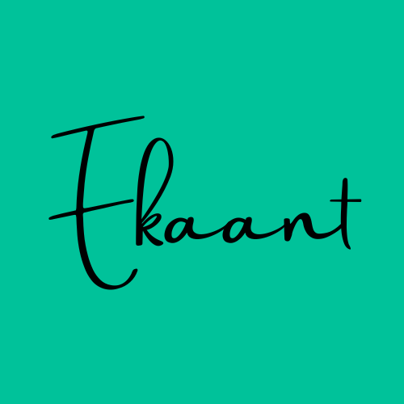
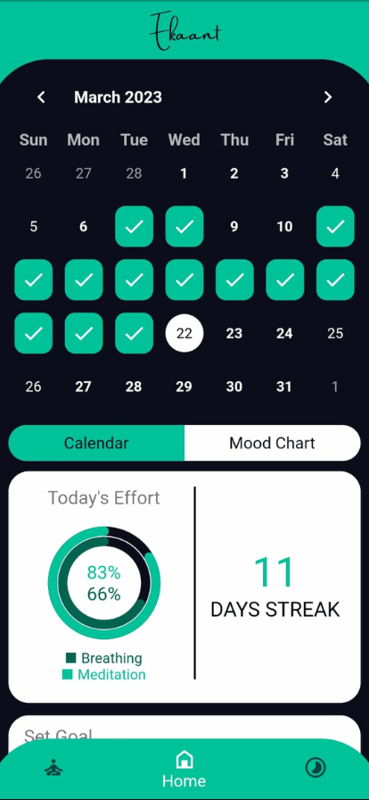
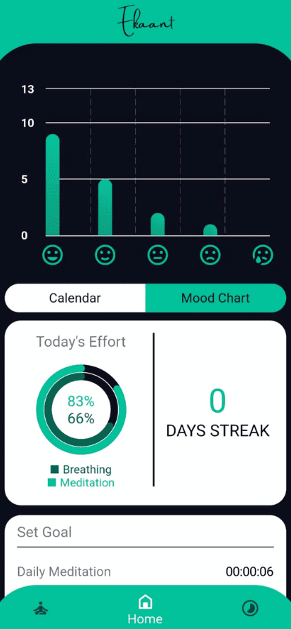
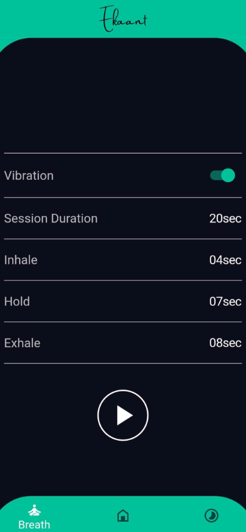
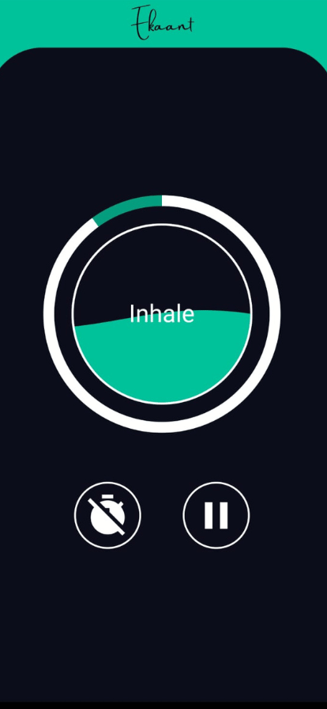

<kbd></kbd>

# Ekaant: make meditaion a habit

#### [Download Ekaant on Play Store](https://play.google.com/store/apps/details?id=com.thetechsurf.ekaant)

  
  
   
  

---
## 🚀 Features
- Meditaion Status Calendar :calendar:
- Streak Counter :hourglass:
- Background Music Player and Selector :headphones:
- Start / End Music Player and Selector :radio:
- Day Goal Progress Indicator :chart_with_upwards_trend:

### 📦 Newly Added Features in Realease

- Breathing Excercise Option :massage:
- Vibration Guide for Breathing Excercise :vibration_mode:

### 🧗 Working on ....

- [ ] Notification on day goal achievement status
- [ ] More background sounds

