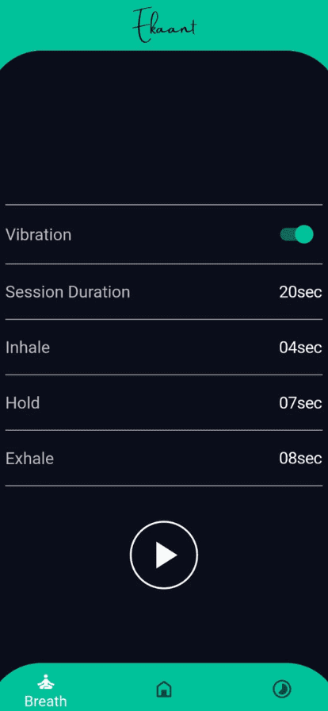

<kbd></kbd>

# Ekaant: make meditaion a habit

#### [Download Ekaant on Play Store](https://play.google.com/store/apps/details?id=com.thetechsurf.ekaant)

  
  
   
  

---
### Vision
---
*There are several applications that offer meditation mentors and videos to help you through the meditaion learning curve. However, ekaant is unique in every way. We at ekaant want to help you make meditation a habit.* 

*We believe that meditaion is journey that must we navigated by the person himself/ herself, the enjoyment you get achieving new stages of meditaion is the absolute. We want everyone to have this absolute experience.* 

---
## 🚀 Features
- Meditaion Status Calendar :calendar:
- Streak Counter :hourglass:
- Background Music Player and Selector :headphones:
- Start / End Music Player and Selector :radio:
- Day Goal Progress Indicator :chart_with_upwards_trend:

### 📦 Newly Added Features in Realease

- Breathing Excercise Option :massage:
- Vibration Guide for Breathing Excercise :vibration_mode:

### 🧗 Working on ....

- [ ] Notification on day goal achievement status
- [ ] More background sounds

